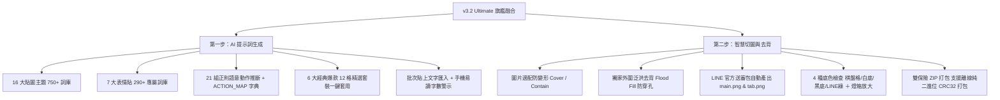
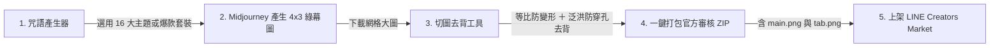

# 🎨 LINE Sticker Maker Pro Max (LINE 貼圖與表情貼旗艦製作工具)

專為 **LINE 貼圖 (Stickers)** 與 **LINE 表情貼 (Emojis)** 打造的全方位專業生產級工具。深度融合：
1. **千詞智慧咒語庫**（16 大情境貼圖分類 ＋ 7 大表情貼分類 ＋ 21 組正則動態神態推斷）
2. **4×3 網格防拉伸智慧切圖**（Cover / Contain 比例自適應）
3. **外圍泛洪防穿孔去背 (Flood Fill)**（保護角色綠衣、綠飾品與內部細節）
4. **LINE 官方送審規格素材一鍵打包**（自動等比產出 `main.png` 240×240、`tab.png` 96×74 與 `01.png~12.png`）

🌐 **線上即開即用（免安裝、跨平台）**：[開啟線上網頁版](https://dinghnes.github.io/line-sticker-maker/)

---

## 🌟 最新旗艦融合亮點 (v3.2 Ultimate Fusion)

---

### 1. 📚 千詞超龐大主題詞庫（超過 1,000+ 精選用語）
* **貼圖 (Stickers) 16 大情境主題（750+ 詞）**：
  * 熱門精選、日常生活、聊天反應、上班工作、**老師／學校**、**家庭生活**、朋友聊天、情侶／撒嬌、鼓勵加油、厭世／耍廢、**吃吃喝喝**、**提醒／催促**、感謝／道歉、**節日慶祝**、搞笑迷因、台灣口語。
* **表情貼 (Emojis) 7 大特寫手勢主題（290+ 詞）**：
  * 表情特寫、手勢動作、工作／活動、老師／學校、心情狀態、裝飾符號、聊天短句。

### 2. 🧠 智慧神態動作推斷引擎（字典精確 ＋ 21 組正則推斷 ＋ 輪巡兜底）
* **動態聯動肢體與神情**：輸入任何自訂文字，系統自動判斷並賦予生動動作（開朗揮手、握拳前傾、低頭道歉、抱肚狂笑、摸肚子期待等），讓 AI 產出的人物不再死板僵硬！
* **動作開關**：可在介面自由切換是否附加動作指令。

### 3. 👑 6 大經典爆款 12 格精選套裝
* 日常高頻必備、上班社畜求生、當紅熱門迷因、道地台味口頭禪、厭世躺平耍廢、撒嬌情侶甜蜜。
* 點擊任一套裝，立即一鍵填滿 12 格！支援「批次貼上文字匯入」功能。

### 4. 📐 圖片適配防止人物拉伸變形 (`fitMode`)
* 支援 **等比例填滿 (Cover)**、完整顯示 (Contain) 與強制拉伸 (Stretch)。
* 自動檢測上傳圖片比例，若非標準 37:24 (貼圖) 或 4:3 (表情貼)，自動進行中心等比無失真自適應，徹底杜絕角色被拉長或壓扁！

### 5. 🛡️ 獨家外圍泛洪防穿孔去背 (Flood Fill)
* 演算法僅由畫布外圍邊界向內蔓延，遇到角色白色外框即刻停止。
* **徹底解決傳統去背破洞問題**：角色身上的綠色眼睛、綠色服飾、綠色飾品 **100% 完整保留**！

### 6. 👑 LINE 官方審核素材包自動產出
* 任意指定貼圖為「★ 封面圖」。
* 打包 ZIP 時自動縮放產出：
  * `main.png`：240 × 240 px (主要封面圖)
  * `tab.png`：96 × 74 px (聊天室標籤圖)
  * `01.png ~ 12.png` (官方標準命名規範)

### 7. 🔍 4 色即時預覽檢查 ＆ 燈箱放大鏡 (Lightbox)
* 即時切換 **🏁 棋盤格 / ⚪ 純白底 / ⚫ 純黑底 / 🟢 LINE 綠底**，毛邊與文字易讀性一目了然。
* 點擊放大鏡即可開啟高清大圖燈箱彈窗，精確檢視微小細節。

### 8. 📦 雙重 ZIP 打包引擎（支援斷網離線）
* 優先採用 JSZip 打包；若處於離線或 CDN 無法載入環境，自動降級啟用內建純原生二進位 CRC32 ZIP 生成器，100% 保證打包成功！

---

## 🚀 製作流程

1. **生成咒語**：在「第一步：生成咒語」選擇畫風與主題詞庫（或套用爆款套裝），一鍵複製 Prompt。
2. **AI 生圖**：前往 Midjourney 貼上提示詞生成 4×3 綠幕大圖並下載。
3. **切圖去背**：進入「第二步：切圖去背」，直接拖曳圖片上傳。
4. **檢查去背**：切換底色檢查邊緣，點選喜歡的貼圖為「★ 封面」。
5. **一鍵打包**：點擊「一鍵打包全部貼圖 (.ZIP)」，立即取得包含 `01.png~12.png`、`main.png`、`tab.png` 的完整送審包！

---

## 📂 專案檔案結構

| 檔案 | 說明 |
| :--- | :--- |
| `index.html` | 線上發布與本機直接執行單檔網頁，具備 v3.2 完整旗艦功能 |
| `line_sticker_maker.html` | 備用獨立單檔 |
| `LineStickerMaker.jsx` | 模組化 React 旗艦元件，相容於 Vite / Next.js 專案 |
| `README.md` | 專案說明文件與使用指南 |

---

## 📄 開源授權
本專案採用 [MIT License](LICENSE) 授權。
