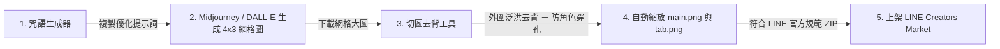

# 🎨 LINE Sticker Maker Pro Max (LINE 貼圖與表情貼一站式製作工具)

專為 **LINE 貼圖 (Stickers)** 與 **LINE 表情貼 (Emojis)** 打造的全方位生產工具。整合 **「AI 咒語產生器」** 與 **「4×3 網格切圖 ＋ 外圍泛洪防穿孔智能去背 ＋ LINE 官方審核素材一鍵打包」**，從 Midjourney / DALL-E 生成到直接上架 LINE 原創市集一氣呵成！

🌐 **線上即開即用（免安裝、跨平台）**：[開啟線上網頁版](https://dinghnes.github.io/line-sticker-maker/)

---

## ✨ 升級亮點 (v2.2 Pro Max)

### 1. 🛡️ 獨家「外圍泛洪去背 (Flood Fill)」演算法
* **告別角色破洞**：傳統全圖去背會誤將角色身上的**綠色眼睛、綠色衣服、綠色飾品**一併挖空。
* **智慧防穿孔**：演算法僅自 4 個外圍邊界向內蔓延，遇到角色外圍白邊自動停止。角色內部的綠色細節 **100% 完整保留**！
* **效能巨幅提升**：採用平方距離過濾（Squared Distance），計算速度提升 5~10 倍，滑動參數即時反饋極致順滑。

### 2. 👑 LINE 官方審查包一鍵搞定（自動產出 main.png & tab.png）
* LINE 官方審核強制要求額外提供：
  * `main.png`：240 × 240 px (主要封面圖)
  * `tab.png`：96 × 74 px (聊天室貼圖標籤圖)
* **自動生成**：可在介面任意指定喜歡的貼圖為封面，打包 ZIP 時系統自動等比縮放產出符合官方規格的 `main.png` 與 `tab.png`。
* **官方標準命名**：一鍵切換 `01.png ~ 12.png` 命名格式，下載即可直接上傳 LINE Creators Market 送審！

### 3. 🔍 4 種背景預覽切換 ＆ 放大檢視 (Lightbox)
* **預覽底色即時切換**：
  * 🏁 **透明棋盤格**：基礎透明度確認。
  * ⚪ **純白底**：檢查文字易讀性與輪廓白邊。
  * ⚫ **純黑底**：檢查有無未清除的白色噪點與雜邊。
  * 🟢 **LINE 綠底**：經典聊天室綠底模擬，所見即所得。
* **點擊放大鏡 (Lightbox)**：彈出高清大圖預覽，方便精細確認人物表情與去背細節。

### 4. 🪄 Prompt 咒語生成擴充
* 支援 10 大情境詞庫、7 種熱門畫風（日系動漫、大眼賽璐璐、3D皮克斯、手繪水彩等）。
* **自動附加負向提示詞 (Negative Prompt)**：預防 Midjourney 生成常見的「多手指、畸變、背景雜點、破裂文字」問題。

---

## 🚀 製作流程圖

1. **生成咒語**：在「第一步：生成咒語」選擇貼圖/表情貼、畫風與詞庫，複製專屬 Prompt。
2. **AI 生圖**：至 Midjourney 或 DALL-E 產生 4×3 綠幕大圖並下載。
3. **切圖去背**：進入「第二步：切圖去背」，直接將圖片**拖曳上傳**。
4. **檢查去背**：切換「白底 / 黑底 / LINE綠」檢查邊緣，點選喜歡的貼圖設為「★ 封面圖」。
5. **一鍵打包**：點擊「一鍵打包全部貼圖 (.ZIP)」，立即取得包含 `01.png~12.png`、`main.png`、`tab.png` 的完整送審包！

---

## 📂 專案檔案結構

| 檔案 | 說明 |
| :--- | :--- |
| `index.html` | 獨立 HTML 網頁版，雙擊即可在瀏覽器離線執行（亦支援直接部署於 GitHub Pages） |
| `line_sticker_maker.html` | 備用獨立單檔 |
| `LineStickerMaker.jsx` | 模組化 React 元件，適用於 Vite / Next.js / React 專案 |
| `README.md` | 專案說明文件與使用指南 |

---

## 📄 開源授權
本專案採用 [MIT License](LICENSE) 授權。
