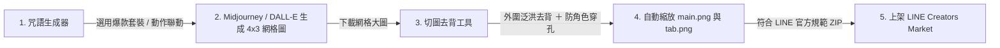

# 🎨 LINE Sticker Maker Pro Max (LINE 貼圖與表情貼一站式製作工具)

專為 **LINE 貼圖 (Stickers)** 與 **LINE 表情貼 (Emojis)** 打造的全方位專業生產工具。整合 **「AI 咒語產生器 (爆款詞庫 ＋ 動作神態深度聯動)」** 與 **「4×3 網格切圖 ＋ 外圍泛洪防穿孔智能去背 ＋ LINE 官方審核素材 (main.png/tab.png) 一鍵打包」**，從 Midjourney / DALL-E 生成到直接上架 LINE 原創市集一氣呵成！

🌐 **線上即開即用（免安裝、跨平台）**：[開啟線上網頁版](https://dinghnes.github.io/line-sticker-maker/)

---

## 🌟 最新升級亮點 (v2.3 Content Pro 內容爆款升級)

### 1. 🧠「文字 ➔ 生動動作與神態」深度聯動字典 (ACTION_MAP)
* **痛點解決**：以往生圖只輸入文字，AI 產出的人物動作千篇一律、表情僵硬死板。
* **生動演繹**：內建豐富動作映射字典，每個詞彙自動附加精準的肢體動作與面部神態描述！
  * *例如：「笑死」 ➔ 誇張抱肚倒地大笑，眼角飆出淚珠，拍地狂笑*
  * *例如：「下班！」 ➔ 背起包包撞破大門興奮狂奔，身後留下殘影與音符*
  * *例如：「我就爛」 ➔ 攤平在地上變成軟爛液體，神態無所謂又放鬆*
* **動作指令開關**：可在介面自由切換是否加入生動動作描述，滿足多樣生成需求。

### 2. 👑 6 大經典爆款 12 格精選套裝（一鍵整套套用）
精研 LINE Creators Market 暢銷排行，精選 6 大主題、每套恰好 12 個高頻黃金詞彙，點擊立即一鍵套用至 12 格中：
1. ☀️ **日常高頻必備**：早安、收到、謝謝、辛苦了、OK、好的、沒問題、稍等、等等、笑死、拜託、再見（日常覆蓋率 90%）。
2. 💼 **上班社畜求生**：收到、開會中、趕工中、加班中、馬上好、求放過、我太難了、下班！、准奏、眼神死、對不起、沒問題（上班族必買共鳴）。
3. 🔥 **當紅熱門迷因**：這我、破防了、笑死、要確欸、急了、很躁、純愛戰士、這把高端局、躺平、是在哈囉、哭啊、超派（網路梗王必備）。
4. 🧋 **道地台味口頭禪**：最好是、是在哈囉、甘阿捏、超派、哭啊、拍謝啦、安啦、讚啦、先不要、誇張欸、沒事啦、笑死（最接地氣生活反應）。
5. ☕ **厭世躺平耍廢**：我就爛、眼神死、躺平、發瘋、壓力山大、傻眼、哭啊、等等、求放過、我太難了、晚安、對不起（極致放空耍廢）。
6. 💖 **撒嬌情侶甜蜜**：想你、愛你、抱抱、親親、好想你、啾咪、理我、吃飽沒、好棒、晚安、早安、辛苦了（融化另一半專屬）。

### 3. 📋 批次文字快速貼上匯入
* 支援由筆記本或試算表一次性貼上多組詞彙（支援換行、逗號、空格等任意分隔符）。
* 系統自動清洗字串並依序填入 12 格，省去逐格手動輸入時間。

### 4. 📏 手機聊天視窗易讀性字數提示
* 依據 LINE 手機端聊天室顯示尺寸，自動標記字數提示：
  * **2 ~ 4 字**：黃金易讀長度，手機畫面一目了然。
  * **超過 5 字**：貼心標記提醒，建議精簡以利手機縮圖辨識。

---

## 🛡️ 核心影像處理功能 (v2.2 Pro Max 旗艦傳承)

### 1. 🛡️ 獨家「外圍泛洪去背 (Flood Fill)」演算法
* **告別角色破洞**：傳統全圖去背會誤將角色身上的**綠色眼睛、綠色衣服、綠色飾品**一併挖空。
* **智慧防穿孔**：演算法僅自 4 個外圍邊界向內蔓延，遇到角色外圍白邊自動停止。角色內部的綠色細節 **100% 完整保留**！
* **極速計算**：採用平方距離過濾（Squared Distance），滑動容差與平滑度即時反饋極致順滑。

### 2. 👑 LINE 官方審查包一鍵搞定（自動產出 main.png & tab.png）
* LINE 官方審核強制要求額外提供：
  * `main.png`：240 × 240 px (主要封面圖)
  * `tab.png`：96 × 74 px (聊天室貼圖標籤圖)
* **自動生成**：可在介面任意指定喜歡的貼圖為封面，打包 ZIP 時系統自動等比縮放產出符合官方規格的 `main.png` 與 `tab.png`。
* **官方標準命名**：一鍵切換 `01.png ~ 12.png` 命名格式，下載即可直接上傳 LINE Creators Market 送審！

### 3. 🔍 4 種背景預覽切換 ＆ 放大檢視 (Lightbox)
* 🏁 **透明棋盤格**：基礎透明度確認。
* ⚪ **純白底**：檢查文字易讀性與輪廓白邊。
* ⚫ **純黑底**：檢查有無未清除的白色噪點與雜邊。
* 🟢 **LINE 綠底**：經典聊天室綠底模擬，所見即所得。
* **點擊放大鏡 (Lightbox)**：彈出高清大圖預覽，方便精細確認人物表情與去背細節。

---

## 🚀 製作流程圖

1. **生成咒語**：在「第一步：生成咒語」選用「6 大爆款精選套裝」或批次匯入文字，系統自動生成包含神態動作的 Midjourney 專屬 Prompt。
2. **AI 生圖**：至 Midjourney 或 DALL-E 產生 4×3 綠幕大圖並下載。
3. **切圖去背**：進入「第二步：切圖去背」，直接將圖片**拖曳上傳**。
4. **檢查去背**：切換「白底 / 黑底 / LINE綠」檢查邊緣，點選喜歡的貼圖設為「★ 封面圖」。
5. **一鍵打包**：點擊「一鍵打包全部貼圖 (.ZIP)」，立即取得包含 `01.png~12.png`、`main.png`、`tab.png` 的完整送審包！

---

## 📂 專案檔案結構

| 檔案 | 說明 |
| :--- | :--- |
| `index.html` | 獨立 HTML 網頁版，雙擊即可在瀏覽器離線執行（亦支援直接部署於 GitHub Pages） |
| `line_sticker_maker.html` | 備用獨立單檔 |
| `LineStickerMaker.jsx` | 模組化 React 元件，適用於 Vite / Next.js / React 專案 |
| `README.md` | 專案說明文件與使用指南 |

---

## 📄 開源授權
本專案採用 [MIT License](LICENSE) 授權。
