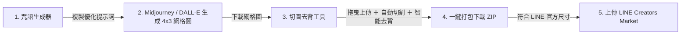

# 🎨 LINE Sticker Maker Pro (LINE 貼圖與表情貼一站式製作工具)

[](LICENSE)
[](https://react.dev/)
[](https://tailwindcss.com/)

一款專為 **LINE 貼圖 (Stickers)** 與 **LINE 表情貼 (Emojis)** 打造的自動化生產工具。整合 **「AI 咒語產生器」** 與 **「4×3 網格自動精準切圖 ＋ 綠幕色鍵智能去背」**，讓您從 Midjourney / DALL-E 生成到打包上架 LINE 原創市集一氣呵成！

🌐 **線上即開即用（無需安裝）**：[開啟網頁版](https://dinghnes.github.io/line-sticker-maker/)

---

## ✨ 核心特色

### 1. 🪄 第一步：Prompt 咒語生成器
* **雙模式支援**：
  * **一般貼圖 (Sticker)**：4×3 網格大圖（1480×960 px），單格 370×320 px，附帶粗白邊與純綠色 (#00FF00) 去背背景。
  * **表情貼 (Emoji)**：大頭特寫＋頭頂文字（720×540 px），單格 180×180 px，適合微縮顯示。
* **多領域情境詞庫**：
  * 貼圖：日常生活、上班社畜、情緒幹話、情侶撒嬌、節日慶祝、搞笑迷因。
  * 表情貼：表情特寫、手勢動作、工作活動標籤、裝飾符號。
* **自訂畫風與語言**：支援日系動漫、大眼賽璐璐、2D 平面可愛、手繪水彩、3D Q版皮克斯、美式卡通、復古像素風。
* **一鍵隨機抽詞與複製**：點擊快速產生 12 格不同動作與表情的提示詞。

### 2. ✂️ 第二步：4×3 網格切圖與智能去背
* **自動精準切片**：完美將 4×3 網格大圖等比切割為 12 張獨立貼圖。
* **Chroma Key 智能色鍵去背**：
  * 綠幕去背（#00FF00）與純黑底去背預設。
  * **色彩容許度 (Tolerance)** 與 **邊緣柔化 (Smoothness)** 調整。
  * **綠幕溢色去除 (Despill)**：自動消除人物邊緣的綠光殘留。
  * **向內縮放裁切 (Crop Scale)**：徹底消除網格格線黑邊。
  * **滴管吸色**：點擊貼圖任意位置即可立即取色去背。
* **自訂匯出與打包**：
  * 自訂檔名前綴與起始流水號（如 `sticker_01.png`）。
  * 單張個別預覽與下載。
  * **JSZip 一鍵打包** 下載全部 12 張透明背景 PNG（`.zip`）。

---

## 🚀 工作流程



1. **生成咒語**：在「第一步：生成咒語」挑選模式、畫風、詞庫後，點擊「複製 Prompt」。
2. **AI 生圖**：前往 Midjourney 或 DALL-E，貼上咒語並提供參考角色生成 4x3 網格大圖。
3. **切圖去背**：切換至「第二步：切圖去背」，將生成的圖片拖曳上傳。
4. **調整參數**：視情況微調「色彩容許度」或「溢色去除」，確保白邊完整、背景透明。
5. **打包下載**：點擊「一鍵下載全部貼圖 (.ZIP)」，立即取得符合 LINE 規格之 12 張透明 PNG 圖檔！

---

## 📂 專案檔案結構

| 檔案 | 說明 |
| :--- | :--- |
| `index.html` | 單一獨立 HTML 網頁版，雙擊即可在瀏覽器離線執行（亦可直接部署於 GitHub Pages） |
| `LineStickerMaker.jsx` | 模組化 React 元件，適用於 Vite / Next.js / Create React App 等前端專案 |
| `README.md` | 專案詳細說明文檔 |

---

## 💻 本地使用方式

### 方式一：直接開啟 HTML（推薦，零依賴）
直接以瀏覽器（Chrome、Edge、Safari、Firefox）開啟 `index.html` 即可完整使用所有功能。

### 方式二：在 React 專案中使用
```bash
npm install lucide-react jszip
```
將 `LineStickerMaker.jsx` 複製到專案的 `components` 目錄中並引用：
```jsx
import LineStickerMaker from './LineStickerMaker';

export default function App() {
  return <LineStickerMaker />;
}
```

---

## 📄 開源授權
本專案採用 [MIT License](LICENSE) 授權。歡迎自由修改與分享！
