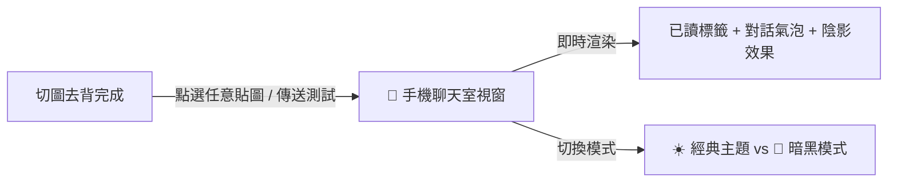

# 🎨 LINE Sticker Maker Pro Creator (LINE 貼圖與表情貼旗艦創作者工具)

專為 **LINE 貼圖 (Stickers)** 與 **LINE 表情貼 (Emojis)** 創作者打造的頂級全流程生產工具。全方位滿足 **LINE Creators Market 最新審查規範**：

1. **👑 官方張數拼裝器**：
   - 支援「**一鍵精選 8 張正式送審包**」，直接符合官方送審門檻！
   - 支援「**+ 追加第 2 批網格圖**」，12 + 12 = 24 張無縫串聯，直接產出官方最熱門的「**24 張正式送審包**」！
   - 貼圖與表情貼智慧狀態判定與警示。
2. **📱 LINE 手機聊天室真實情境模擬器**：
   - 內建高擬真手機聊天視窗，支援「**LINE 經典綠/藍**」與「**暗黑模式**」。
   - 點擊任意貼圖即可如同發送真實訊息般，彈出帶有時間戳與「已讀」的對話氣泡，所見即所得驗證字體易讀性與視覺效果！
3. **🛡️ LINE 官方 10px 透明安全邊距防退件保證**：
   - 自動在畫布外圍預留 10px 透明安全邊距，徹底杜絕角色/文字貼齊邊界遭官方審核退件。
4. **🛡️ 獨家外圍泛洪防穿孔去背 (Flood Fill)**：
   - 角色身上的綠色眼睛、綠色服裝、飾品 100% 完整保護不破洞。
5. **📚 16 大貼圖主題 750+ 詞庫 ＋ 7 大表情貼主題 290+ 詞庫**：
   - 整合 `ACTION_MAP` 精確字典 ＋ 21 組正則動態神態動作推斷引擎。

🌐 **線上即開即用（免安裝、跨平台）**：[開啟線上網頁版](https://dinghnes.github.io/line-sticker-maker/)

---

## 🌟 創作者必看：LINE 官方送審規範速查

| 規格項目 | 🟢 LINE 一般靜態貼圖 (Stickers) | 🟣 LINE 一般表情貼 (Emojis) |
| :--- | :--- | :--- |
| **官方送審張數限制** | **只能選 8 / 16 / 24 / 32 / 40 張** | **8 ～ 40 張皆可**（任意整數張） |
| **本工具解決方案** | 1. 點擊「一鍵精選前 8 張」$
ightarrow$ 產出 **8 張送審包** 2. 點擊「+追加第2批」$
ightarrow$ 產出 **24 張送審包** | 12 格切圖直接符合 8~40 張規定，為**正式送審包** |
| **主要封面圖 (main.png)** | **強制需要**（240 × 240 px，系統自動等比產出） | ❌ **不需要**（官方規定無此欄位） |
| **聊天室標籤圖 (tab.png)** | **強制需要**（96 × 74 px，系統自動等比產出） | **強制需要**（96 × 74 px，系統自動等比產出） |
| **圖檔編號格式** | `01.png` ～ `24.png`（兩位數編號） | `001.png` ～ `040.png`（三位數編號） |
| **透明安全邊距** | **強制約 10px**（系統自動防退件縮放） | **強制約 10px**（系統自動防退件縮放） |

---

## 📱 功能演示：LINE 聊天室模擬器

---

## 📂 專案檔案結構

| 檔案 | 說明 |
| :--- | :--- |
| `index.html` | 線上發布與本機直接執行單檔網頁，具備 v3.4 旗艦創作者版完整功能 |
| `line_sticker_maker.html` | 備用獨立單檔 |
| `LineStickerMaker.jsx` | 模組化 React 旗艦元件，相容於 Vite / Next.js 現代前端框架 |
| `README.md` | 專案說明文件與官方送審規範指南 |

---

## 📄 開源授權
本專案採用 [MIT License](LICENSE) 授權。
