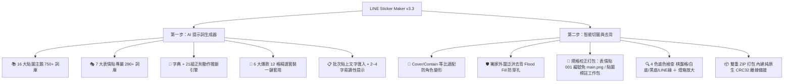
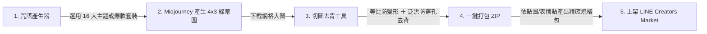

# 🎨 LINE Sticker Maker Pro Max (LINE 貼圖與表情貼旗艦製作工具)

專為 **LINE 貼圖 (Stickers)** 與 **LINE 表情貼 (Emojis)** 打造的專業生產級製作工具。符合 **LINE Creators Market 最新官方上架規格**：
1. **官方上架規格精確校正**：明確區分「貼圖 12 張工作包」與「表情貼 12 張送審包（001~012 編號 ＋ 僅需 tab.png）」。
2. **千詞智慧咒語庫**（16 大情境貼圖分類 ＋ 7 大表情貼分類 ＋ 21 組正則動態神態推斷）。
3. **4×3 網格防拉伸智慧切圖**（Cover / Contain 比例自適應，徹底杜絕角色變形）。
4. **外圍泛洪防穿孔去背 (Flood Fill)**（保護角色綠衣、綠飾品與內部細節 100% 不破洞）。
5. **官方規範審查素材自動生成**（一般貼圖產出 `main.png` 240×240、`tab.png` 96×74；表情貼產出 `tab.png` 96×74）。

🌐 **線上即開即用（免安裝、跨平台）**：[開啟線上網頁版](https://dinghnes.github.io/line-sticker-maker/)

---

## ⚖️ LINE 官方規範與本工具規格對照 (v3.3 重要校正)

| 項目 | 🟢 LINE 一般靜態貼圖 (Stickers) | 🟣 LINE 一般表情貼 (Emojis) |
| :--- | :--- | :--- |
| **官方送審張數規定** | **只能選 8 / 16 / 24 / 32 / 40 張** | **8 ～ 40 張皆可**（任意整數張） |
| **本工具 12 格切圖定位** | 🗂️ **12 張工作包**（方便創作者批量累積素材，建議製作兩批湊 24 張送審） | ✅ **官方合法送審包**（12 張完全符合 8~40 張規定） |
| **主要封面圖 (main.png)** | **強制需要**（240 × 240 px） | **不需要**（官方表情貼無 main.png 欄位） |
| **聊天室標籤圖 (tab.png)** | **強制需要**（96 × 74 px） | **強制需要**（96 × 74 px） |
| **貼圖檔名編號格式** | `01.png` ～ `12.png`（兩位數編號） | `001.png` ～ `012.png`（三位數編號） |
| **單張圖片尺寸上限** | 370 × 320 px (建議等比填滿) | 180 × 180 px (固定微縮特寫) |

---

## 🌟 核心功能一覽

---

## 🚀 製作流程

1. **生成咒語**：在「第一步：生成咒語」選擇畫風與主題詞庫（或套用爆款套裝），一鍵複製 Prompt。
2. **AI 生圖**：前往 Midjourney 貼上提示詞生成 4×3 綠幕大圖並下載。
3. **切圖去背**：進入「第二步：切圖去背」，直接拖曳圖片上傳。
4. **檢查去背**：切換底色檢查邊緣，點選喜歡的貼圖為「★ 封面」。
5. **一鍵打包**：點擊「打包目前 12 張 (.ZIP)」，立即取得符合官方規格之素材包！

---

## 📂 專案檔案結構

| 檔案 | 說明 |
| :--- | :--- |
| `index.html` | 線上發布與本機直接執行單檔網頁，具備 v3.3 規格校正版完整功能 |
| `line_sticker_maker.html` | 備用獨立單檔 |
| `LineStickerMaker.jsx` | 模組化 React 旗艦元件，相容於 Vite / Next.js 專案 |
| `README.md` | 專案說明文件與官方送審規範指南 |

---

## 📄 開源授權
本專案採用 [MIT License](LICENSE) 授權。
